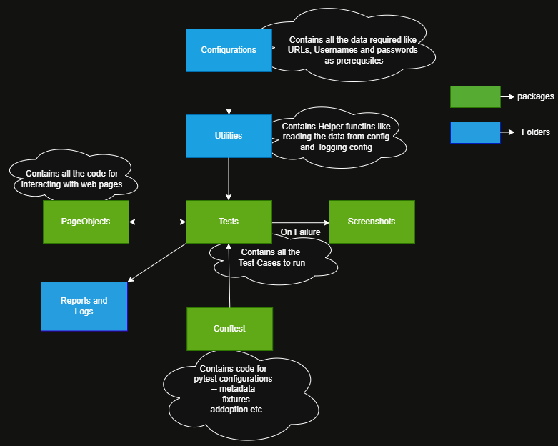

# 🛒 E-Commerce Test Automation Framework with Selenium & Pytest

This project is a **Test Automation Framework** built using **Python**, **Selenium**, and **Pytest**. It automates core user flows of an **e-commerce website**, and demonstrates best practices in test design, reporting, logging, and scalability.

---

## 📌 Key Features

- ✅ **Selenium WebDriver** for browser automation
- ✅ **Pytest** for test execution and fixtures
- ✅ **Page Object Model** for maintainable code
- ✅ **HTML Reports** using `pytest-html`
- ✅ **Logging** with time-stamped log files
- ✅ **Screenshots on Failure**
- ✅ Easy-to-read project structure

---

## 🔧 Installation & Setup

**Clone the Repository** - git clone `https://github.com/satya12388/TestFramework` - Create an Virtual environment - run pytest -v --html=Reports/report.html TestCases
